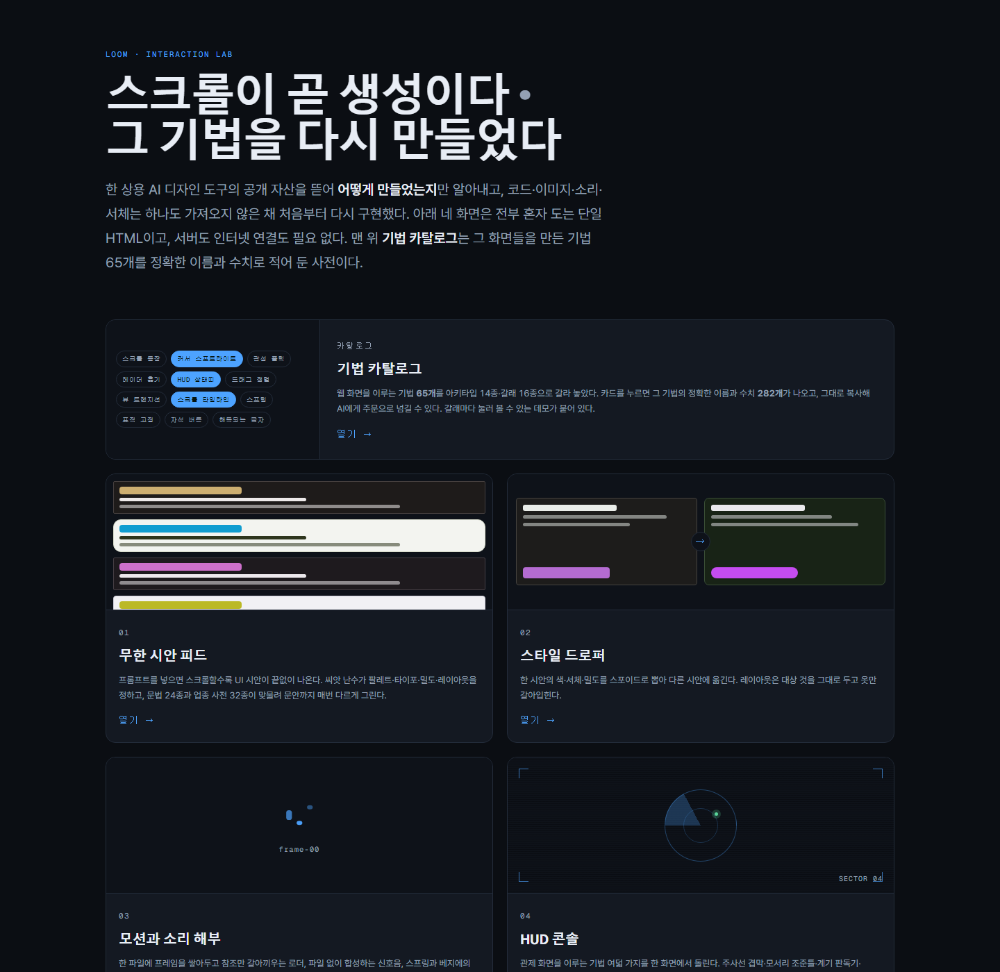
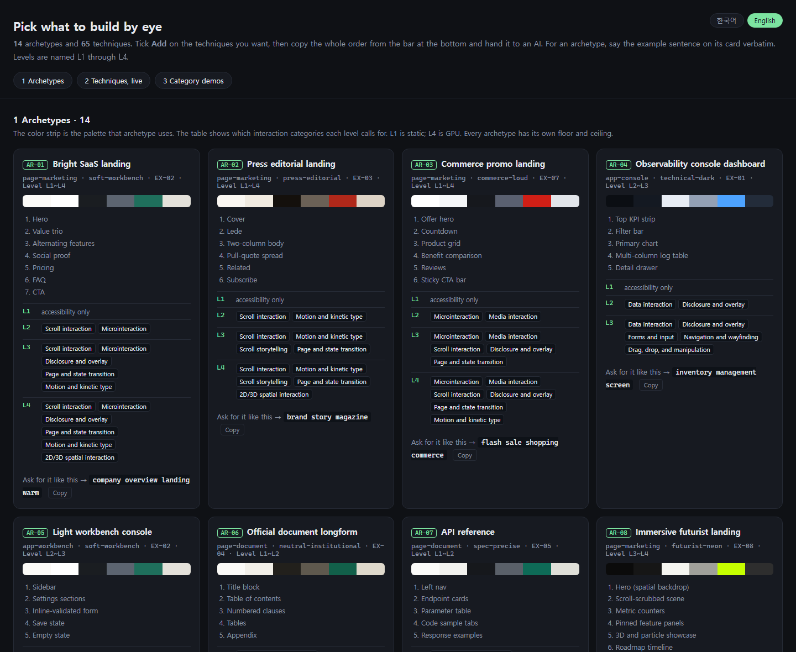
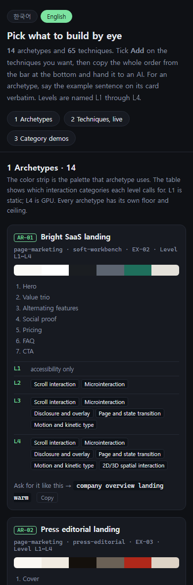
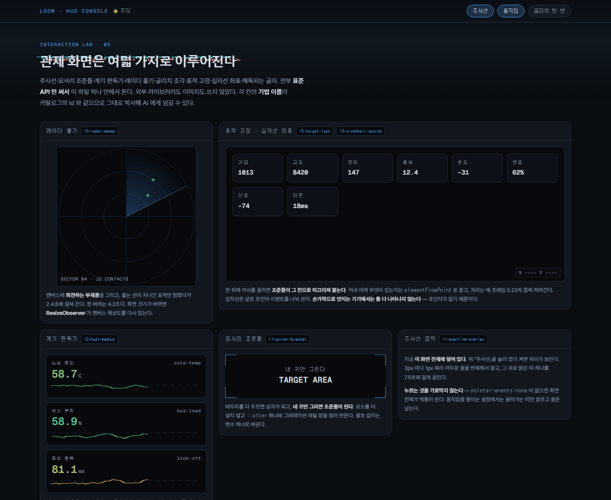

# Loom — Interaction Lab

[한국어](README.md) · **English**

[](https://capernaum-user.github.io/loom-interaction-lab/)
[](LICENSE)


[](https://capernaum-user.github.io/loom-interaction-lab/01_Pages/LoomLab_index_active.html)

Four interaction techniques from a commercial AI design tool, worked out from public assets alone and then **rebuilt from scratch without using a single original file**.

Five self-contained HTML files. Double-click one and it runs. No server, no build step, no install.

Alongside them sits the **craft catalog**: 65 techniques written down with their exact names and numbers. Click a card, copy it, and you have an order ready to hand to an AI.

## Screens

Everything is live at **https://capernaum-user.github.io/loom-interaction-lab/**, and works the same if you download it and open the file directly.

| Screen | What it is |
|---|---|
| [**Lab index**](https://capernaum-user.github.io/loom-interaction-lab/01_Pages/LoomLab_index_active.html) | What was imitated and what was deliberately left behind |
| [**Endless variant feed**](https://capernaum-user.github.io/loom-interaction-lab/01_Pages/LoomLab_endless-feed_active.html) | Type a prompt and screen mockups keep arriving as you scroll |
| [**Style dropper**](https://capernaum-user.github.io/loom-interaction-lab/01_Pages/LoomLab_style-dropper_active.html) | Pick color, type, and density off one mockup and drop it on another |
| [**Motion and sound teardown**](https://capernaum-user.github.io/loom-interaction-lab/01_Pages/LoomLab_motion-sound_active.html) | Frame-sequence loader, synthesized cues, spring versus bezier |
| [**HUD console**](https://capernaum-user.github.io/loom-interaction-lab/01_Pages/LoomLab_hud-console_active.html) | Eight control-room techniques running on one screen |
| [**Craft catalog**](https://capernaum-user.github.io/loom-interaction-lab/04_Catalog/LoomLab_craft-catalog_active.html) | Pick from 65 techniques and copy their names and numbers as a prompt |

> **A note on language.** The catalog is bilingual: a `한국어 / English` switch sits in its top-right corner and swaps every name, description, value, and code comment, including what the copy buttons hand you. The four demo screens are Korean-only for now.

## The craft catalog

[](https://capernaum-user.github.io/loom-interaction-lab/04_Catalog/LoomLab_craft-catalog_active.html)

### Why it exists

Tell an AI to "make it fade in nicely" and you get something different every time. Give it the exact name and the exact numbers and you get the same thing every time. The catalog turns the first sentence into the second. One card copies out like this:

```
Scroll reveal (l2-reveal-observer)
Reach for this when content enters in sequence as the page scrolls down.
Unobserve each element the moment it fires.
APIs — IntersectionObserver, CSS transition, stagger
Values — Observer threshold 0.18 · Bottom slack rootMargin 0px 0px -8% 0px ·
         Start position translateY(14px) · opacity 0 · Reveal duration 0.5s ·
         Stagger step 60ms × up to 6 cells · Unobserve once seen
Fallback — When IO is unsupported, apply .is-in immediately so everything shows
reduced-motion — Skip the observer and hold the final state from the start
```

Paste it and you are done. The fallback and the accessibility condition travel with it, so the AI does not drop them.

### How to use it

1. Pick the **archetype** closest to the screen you are building, out of 14
2. Tick **Add** on the technique cards you want. Take as many as you like
3. Press **Copy order** in the bar at the bottom. You get a numbered order in the order you picked
4. Paste it into your AI chat

Every card carries three buttons. `Name` gives you the name alone, `Copy with values` gives you the block above, and `Code` gives you the snippet that actually runs.

### What is inside

| Axis | Size |
|---|---|
| Archetypes | 14 |
| Techniques | 65 |
| Named values | 283 |
| Interaction categories | 16 |
| Category demos | 16, clickable inside the catalog |

Techniques are graded L1 through L4. L1 is static; L4 uses the GPU. By family: scroll 7 · HUD 8 · data 6 · pointer 5 · microinteraction 5 · overlay 4 · layout 4 · manipulation 4 · spatial 4 · generative 4 · form 3 · other 11.

Files live in `04_Catalog/`.

| Desktop | Mobile |
|---|---|
| [](https://capernaum-user.github.io/loom-interaction-lab/04_Catalog/LoomLab_craft-catalog_active.html) | [](https://capernaum-user.github.io/loom-interaction-lab/04_Catalog/LoomLab_craft-catalog_active.html) |
| Cards split to fit the width | Folds to a single column |

## HUD console

[](https://capernaum-user.github.io/loom-interaction-lab/01_Pages/LoomLab_hud-console_active.html)

Eight control-room techniques run at once: scanline overlay, corner brackets, telemetry readout, radar sweep, glitch slice, target lock, crosshair coordinates, and decoding text. Each panel is labeled with its catalog id, so anything you like can be looked up in the catalog and copied with its numbers.

## How it works

Mockups come from a procedural generator, not a language model. The prompt and the card index are mixed into a 32-bit seed, and the random stream that seed produces decides palette, typography, density, and layout. **The same prompt at the same index gives the same mockup every time you open it.**

| Axis | Size |
|---|---|
| Layout grammars | 24 |
| Industry dictionaries | 32 (499 keywords; English prompts route through the same dictionaries) |
| Sentence templates | 264, across three length bands |
| Dictionary x grammar combinations | 768 |

Two devices exist on top of that for Korean text: particles are chosen automatically from the final consonant of the word they follow, and card height tracks sentence length by subscribing to height changes rather than guessing a moment when the webfont has settled.

## What was not taken

None of the original's documents, styles, script bundles, loader files, sound files, or typefaces were used. Every image and every sound on these screens is computed in the browser.

That site's `robots.txt` disallows the paths where the mockups live, so those paths were never opened. Only the top-level documents and static assets anyone can fetch were examined.

Method and asset were held apart. "Stack the frames in one file and swap only the reference" is a method; the frames somebody drew with that method are a work. Trademarks were treated the same way. The original tool's name and logo appear nowhere on these screens.

## Differences from the original

| | Original tool | This lab |
|---|---|---|
| What makes the mockups | A language model | A procedural generator |
| Internet | Required | Only to fetch webfonts |
| Same request twice | Different every time | Always identical |
| Cost | Free credits, then paid | None |

Being procedural, it cannot read deeply into what a prompt means. In exchange it runs offline and reproduces exactly.

## Checks

Run under headless Chrome.

| Check | Result |
|---|---|
| Dictionary x grammar exhaustive render | 768 runs · 0 failures |
| Sentence generation | 8,320 runs · 0 defects |
| Dictionary routing | 47 cases · all as expected |
| Particle boundary cases | 21 cases · 0 failures |
| Reproducibility | 1,600 pairs · 0 mismatches |
| Card height | 0 overflow · 0 slack |
| Runtime errors | 0 on all five screens |
| Horizontal scroll at 320px and 390px | None anywhere, catalog included |
| HUD console craft level | craft-check L3 PASS · 12 fingerprints · canvas 1/1 painted |
| Catalog live demos | 65 slots, all mounted · 0 errors |
| English mode | 0 Hangul left on screen apart from the 한국어 switch itself |
| Snippet parity | 65/65 identical code in both languages, comments aside |

## Fonts

Fonts load from a CDN `<link>` only; none are bundled. Roboto Flex and Geist Mono come from Google Fonts, Pretendard from jsDelivr. With no internet the pages fall back to system fonts and keep working.

All three carry the SIL Open Font License, separate from the MIT license below. This repository ships no font files, so it is not redistributing them.

## License

[MIT](LICENSE). Take it, change it, ship it. Keep the copyright notice and the license text with it.
