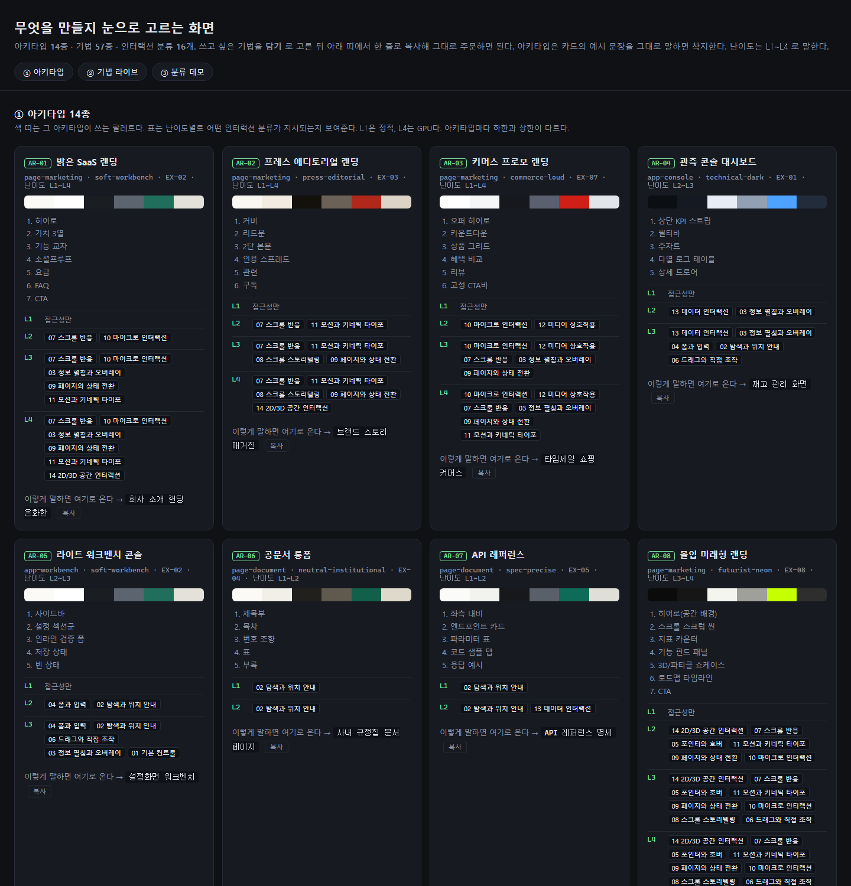
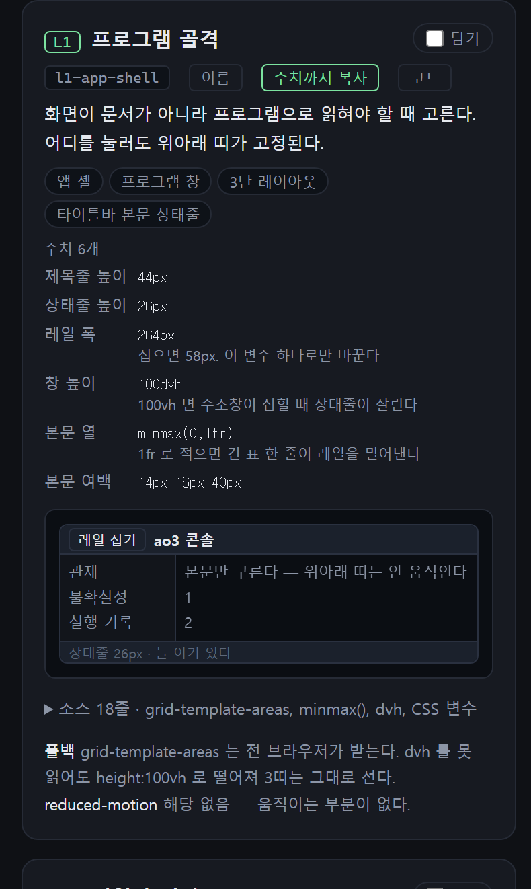
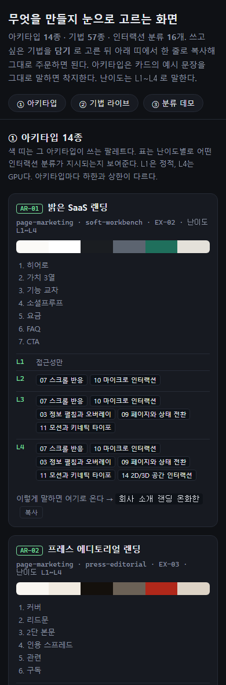
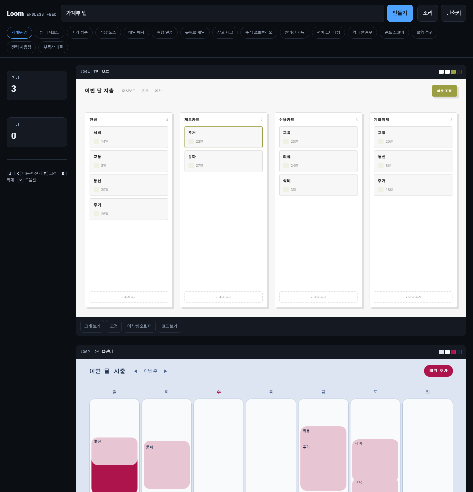
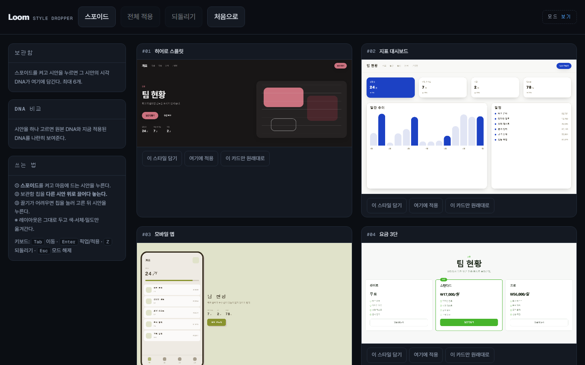
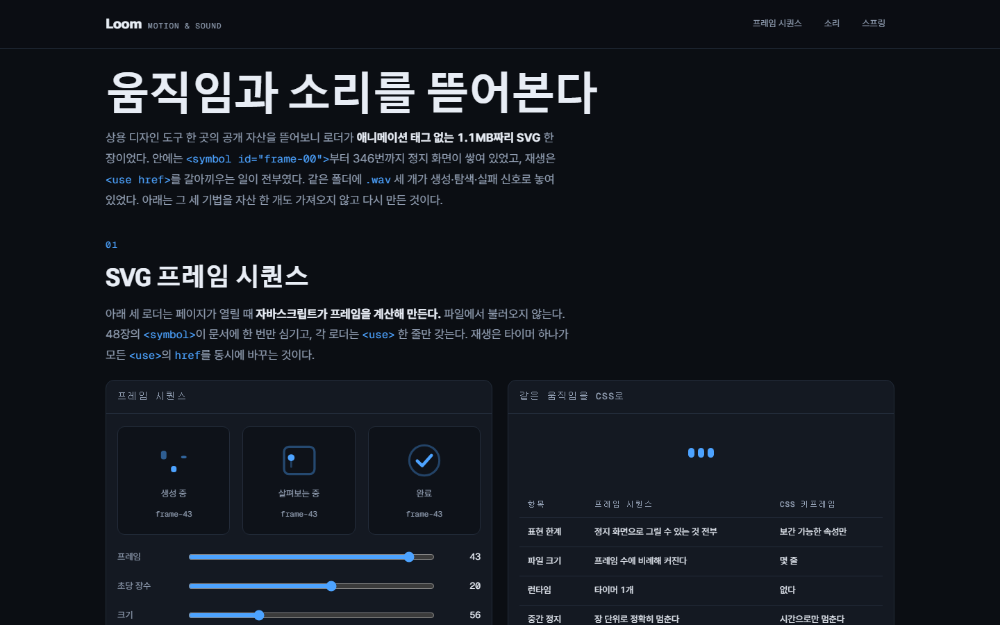
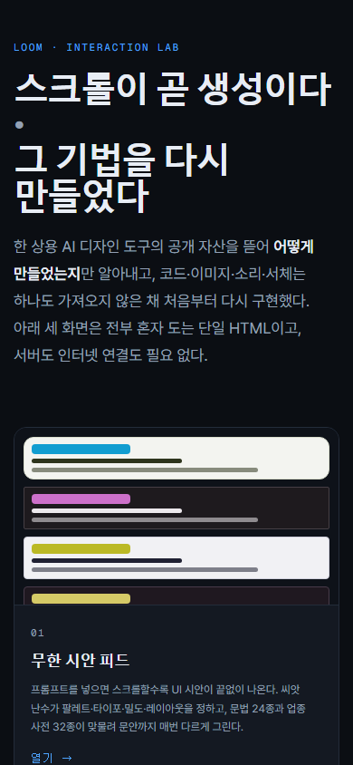
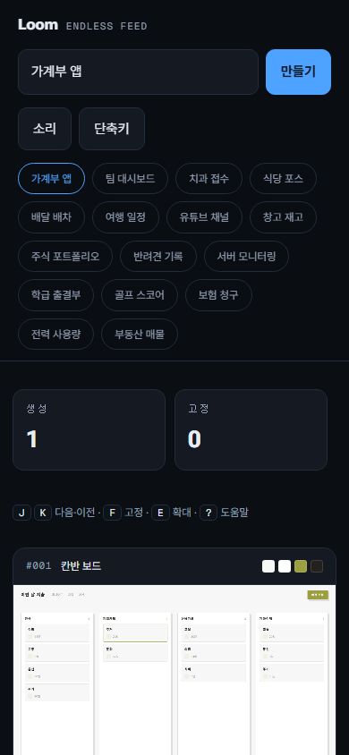
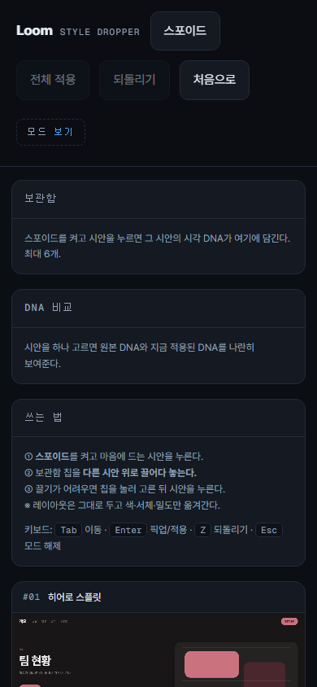
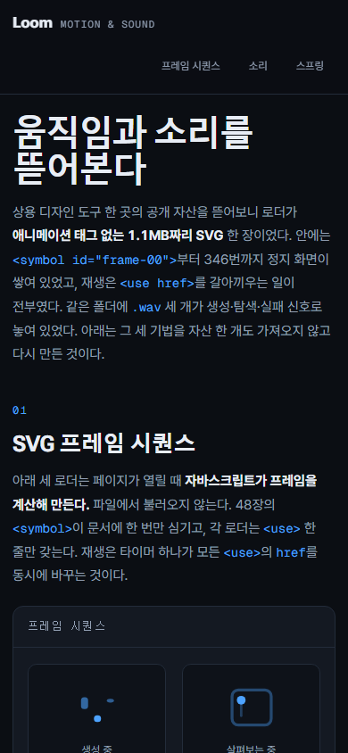

# Loom — 인터랙션 랩

[](https://capernaum-user.github.io/loom-interaction-lab/)
[](LICENSE)


[](https://capernaum-user.github.io/loom-interaction-lab/01_Pages/LoomLab_index_active.html)

한 상용 AI 디자인 도구의 인터랙션 기법 네 가지를 공개된 자산만 보고 알아낸 뒤, **원본 파일을 한 개도 쓰지 않고 처음부터 다시 구현한** 화면 모음이다.

자기완결 단일 HTML 넉 장이다. 두 번 눌러 브라우저로 열면 그대로 돈다. 서버도 빌드도 설치도 필요 없다.

여기에 **기법 카탈로그**가 붙어 있다. 이 화면들을 만든 기법 57개를 정확한 이름과 수치로 적어 둔 사전이고, 카드를 눌러 그대로 복사하면 AI 에게 넘길 주문이 된다.

## 화면

**https://capernaum-user.github.io/loom-interaction-lab/** 에서 바로 볼 수 있다. 내려받아 두 번 눌러 열어도 똑같이 돈다.

| 화면 | 무엇 |
|---|---|
| [**랩 입구**](https://capernaum-user.github.io/loom-interaction-lab/01_Pages/LoomLab_index_active.html) | 무엇을 모방했고 무엇을 가져오지 않았는지 |
| [**무한 시안 피드**](https://capernaum-user.github.io/loom-interaction-lab/01_Pages/LoomLab_endless-feed_active.html) | 프롬프트를 넣으면 스크롤할수록 화면 시안이 끝없이 나온다 |
| [**스타일 드로퍼**](https://capernaum-user.github.io/loom-interaction-lab/01_Pages/LoomLab_style-dropper_active.html) | 한 시안의 색·서체·밀도를 뽑아 다른 시안에 옮긴다 |
| [**모션과 소리 해부**](https://capernaum-user.github.io/loom-interaction-lab/01_Pages/LoomLab_motion-sound_active.html) | 프레임 시퀀스 로더·합성 신호음·스프링 대 베지에 |
| [**기법 카탈로그**](https://capernaum-user.github.io/loom-interaction-lab/04_Catalog/LoomLab_craft-catalog_active.html) | 기법 57개를 골라 이름과 수치를 프롬프트로 복사한다 |

파일은 `01_Pages/` 안에 있다.

## 기법 카탈로그

[](https://capernaum-user.github.io/loom-interaction-lab/04_Catalog/LoomLab_craft-catalog_active.html)

### 왜 필요한가

AI 에게 "부드럽게 나타나게 해 줘" 라고 하면 매번 다른 것이 나온다. 정확한 이름과 수치를 주면 같은 것이 나온다. 카탈로그는 앞의 말을 뒤의 말로 바꿔 준다. 카드 하나를 복사하면 이런 글이 나온다.

```
스크롤 등장 (l2-reveal-observer)
아래로 내려가며 내용이 차례로 들어올 때. 관찰이 끝난 요소는 즉시 관찰을 푼다.
쓰는 API — IntersectionObserver, CSS transition, stagger
수치 — 관찰 임계 0.18 · 하단 여유 rootMargin 0px 0px -8% 0px · 시작 위치 translateY(14px) ·
       opacity 0 · 나타나는 시간 0.5s · 차례 간격 60ms × 최대 6칸 · 관찰 해제 한 번 보이면 unobserve
폴백 — IO 미지원 시 .is-in 을 즉시 부여해 전부 보이게 한다
reduced-motion — 관찰을 걸지 않고 처음부터 최종 상태로 둔다
```

그대로 붙여 넣으면 된다. 폴백과 접근성 조건까지 함께 가므로 AI 가 빠뜨리지 않는다.

[](https://capernaum-user.github.io/loom-interaction-lab/04_Catalog/LoomLab_craft-catalog_active.html)

카드 한 장의 속이다. 수치마다 사람이 붙인 이름이 있고 왜 그 값인지가 아래 줄에 붙는다. `레일 폭 264px` 아래의 "접으면 58px. 이 변수 하나로만 바꾼다" 같은 것이다.

### 어떻게 쓰나

1. 위쪽 띠에서 **아키타입** 14종 중 만들 화면에 가까운 것을 고른다
2. 기법 카드에서 쓰고 싶은 것에 **담기**를 누른다. 여러 개 골라도 된다
3. 화면 아래 띠에서 **복사**를 누른다. 고른 순서대로 번호가 붙은 주문이 만들어진다
4. AI 대화창에 붙여 넣는다

카드마다 버튼이 셋이다. `이름` 은 기법 이름만, `수치까지 복사` 는 위 예시처럼 값과 폴백까지, `코드` 는 실제로 도는 스니펫을 준다.

### 무엇이 들어 있나

| 축 | 규모 |
|---|---|
| 아키타입 | 14종 |
| 기법 | 57개 |
| 이름 붙인 수치 | 233개 |
| 인터랙션 갈래 | 16종 |
| 갈래별 데모 | 16장 (카탈로그 안에서 바로 눌러 본다) |

기법은 난이도 L1~L4 로 나뉜다. L1 은 정적이고 L4 는 GPU 를 쓴다. 계열은 스크롤 7 · 데이터 6 · 포인터 5 · 마이크로인터랙션 5 · 오버레이 4 · 레이아웃 4 · 조작 4 · 공간 4 · 생성 4 · 폼 3 · 그 밖 11 이다.

파일은 `04_Catalog/` 안에 있다.

| 데스크톱 | 모바일 |
|---|---|
| [](https://capernaum-user.github.io/loom-interaction-lab/04_Catalog/LoomLab_craft-catalog_active.html) | [](https://capernaum-user.github.io/loom-interaction-lab/04_Catalog/LoomLab_craft-catalog_active.html) |
| 카드가 화면 폭에 맞춰 갈린다 | 한 칸으로 접힌다 |

## 미리보기

헤드리스 크롬으로 찍은 실제 화면이다. 아래 셋은 가로 1440px 이고, 맨 끝 모바일 줄은 세로 390×844 다. 맨 위 큰 그림이 랩 입구이고, 어느 그림이든 누르면 그 화면이 열린다.

### 무한 시안 피드

[](https://capernaum-user.github.io/loom-interaction-lab/01_Pages/LoomLab_endless-feed_active.html)

카드마다 팔레트·서체·레이아웃이 갈린다. 위 두 장은 같은 프롬프트 `가계부 앱` 이 뽑아낸 1번과 2번이다. 스크롤을 내리면 같은 방식으로 계속 이어진다.

### 스타일 드로퍼

[](https://capernaum-user.github.io/loom-interaction-lab/01_Pages/LoomLab_style-dropper_active.html)

레이아웃 24종이 각각 다른 시각 DNA 로 놓인다. 화면에 보이는 것은 그중 넷이다. 스포이드로 하나를 뽑아 보관함에 담았다가 다른 카드 위로 끌어 놓으면 색·서체·밀도만 옮겨 간다.

### 모션과 소리 해부

[](https://capernaum-user.github.io/loom-interaction-lab/01_Pages/LoomLab_motion-sound_active.html)

프레임 48장을 한 파일에 쌓아 두고 참조 한 줄만 갈아끼운다. 같은 움직임을 CSS 로 냈을 때와 무엇이 달라지는지 표로 견준다.

### 모바일

같은 넉 장을 세로 390×844 에서 찍었다. 아이폰 세로 논리 해상도다. 넉 장 모두 한 칸으로 접힌다. 가로 390px 과 320px 에서 재 보니 문서의 `scrollWidth` 가 `clientWidth` 와 같아 페이지가 옆으로 밀리지 않는다. 긴 코드 줄만 제 상자 안에서 가로로 움직인다.

| 랩 입구 | 무한 시안 피드 | 스타일 드로퍼 | 모션과 소리 해부 |
|---|---|---|---|
| [](https://capernaum-user.github.io/loom-interaction-lab/01_Pages/LoomLab_index_active.html) | [](https://capernaum-user.github.io/loom-interaction-lab/01_Pages/LoomLab_endless-feed_active.html) | [](https://capernaum-user.github.io/loom-interaction-lab/01_Pages/LoomLab_style-dropper_active.html) | [](https://capernaum-user.github.io/loom-interaction-lab/01_Pages/LoomLab_motion-sound_active.html) |
| 카드가 한 줄로 쌓인다 | 입력칸과 버튼이 세로로 나뉘고 칩이 접힌다 | 보관함이 시안 위로 올라온다 | 차림표가 제목 아래로 접힌다 |

## 어떻게 도나

시안은 언어모델이 아니라 절차적 생성기가 만든다. 프롬프트와 순번을 섞어 32비트 씨앗을 만들고, 그 씨앗으로 돌린 난수가 팔레트·타이포·밀도·레이아웃을 정한다. **같은 프롬프트의 같은 순번은 언제 열어도 같은 시안이 나온다.**

| 축 | 규모 |
|---|---|
| 레이아웃 문법 | 24종 |
| 업종 사전 | 32종 (키워드 499개, 영문 프롬프트도 같은 사전으로 간다) |
| 문장 틀 | 264개 (길이대 셋. 한 마디부터 두 문장까지) |
| 사전 × 문법 조합 | 768가지 |

그 위에 한국어를 위한 장치가 둘 있다.

- **조사를 자동으로 고른다.** 틀에 `{i0}을` 이라고 적으면 채워진 낱말의 받침을 보고 을·를, 이·가, 은·는, 과·와, 으로·로 를 정한다. 채운 값 끝에만 보이지 않는 표시를 남겼다가 그 표시 뒤에 붙은 조사만 손대므로, 원문에 있던 낱말은 건드리지 않는다.
- **카드 높이가 문장 길이를 따라간다.** 그린 뒤 실제 높이를 재서 카드 비율에 넣는다. 한글 서체는 글자가 나올 때마다 조각을 나눠 받아 다 그린 뒤에도 글이 다시 흐르므로, 시점을 맞히는 대신 높이 변화를 구독해 따라간다.

## 무엇을 가져오지 않았나

원본의 문서와 스타일, 자바스크립트 번들, 로더 파일, 소리 파일, 서체를 하나도 쓰지 않았다. 화면의 그림과 소리는 전부 브라우저에서 계산해 만든다.

그 사이트의 `robots.txt` 가 시안이 놓인 경로를 크롤 금지로 두고 있어 그 경로는 열지 않았다. 확인한 것은 누구나 받을 수 있는 최상위 문서와 정적 자산뿐이다.

기법과 자산을 갈라서 봤다. 한 파일에 프레임을 쌓고 참조만 바꾼다는 발상은 방법이고, 그 방법으로 누군가 그린 그림은 저작물이다. 상표도 같은 기준을 뒀다. 어느 화면에도 원본 도구의 이름이나 로고가 나오지 않는다.

## 원본과 다른 점

| 항목 | 원본 도구 | 이 랩 |
|---|---|---|
| 시안을 만드는 것 | 언어모델 | 절차적 생성기 |
| 인터넷 | 필요하다 | 서체를 받을 때만 쓴다 |
| 같은 요청의 결과 | 매번 달라진다 | 항상 같다 |
| 비용 | 무료 크레딧 뒤에는 유료 | 없다 |

절차적 생성기라 프롬프트의 의미를 깊이 읽지는 못한다. 대신 오프라인에서 돌고 결과가 재현된다.

## 검사

헤드리스 크롬으로 돌린 결과다.

| 검사 | 결과 |
|---|---|
| 사전 × 문법 전수 렌더 | 768회 · 실패 0 |
| 문장 생성 | 8,320회 · 결함 0 |
| 사전 라우팅 | 47건 · 전부 기대와 일치 |
| 조사 경계 시험 | 21건 · 실패 0 |
| 재현성 | 1,600쌍 · 불일치 0 |
| 카드 높이 | 넘침 0장 · 남음 0장 |
| 런타임 오류 | 넉 장 모두 0건 |
| 320px · 390px 가로 스크롤 | 넉 장 모두 없음 · 카탈로그도 없음 |
| 카탈로그 갈래 데모 렌더 | 16장 · 실패 0 · 런타임 오류 0 |
| 카탈로그 카드 · 수치 표 · 복사 버튼 | 각 57개 |

## 서체

서체는 CDN `<link>` 로만 불러온다. 파일로 동봉하지 않았다. Roboto Flex 와 Geist Mono 는 Google Fonts, Pretendard 는 jsDelivr 에서 온다. 인터넷이 끊겨 있으면 시스템 서체로 떨어질 뿐 기능은 그대로 돈다.

세 서체 모두 SIL Open Font License 를 따르며 아래 MIT 와는 별개다. 이 저장소는 서체 파일을 담고 있지 않으므로 재배포에 해당하지 않는다.

## 라이선스

[MIT](LICENSE). 가져다 쓰고 고치고 다시 배포해도 된다. 저작권 표시와 라이선스 전문만 함께 남기면 된다.
